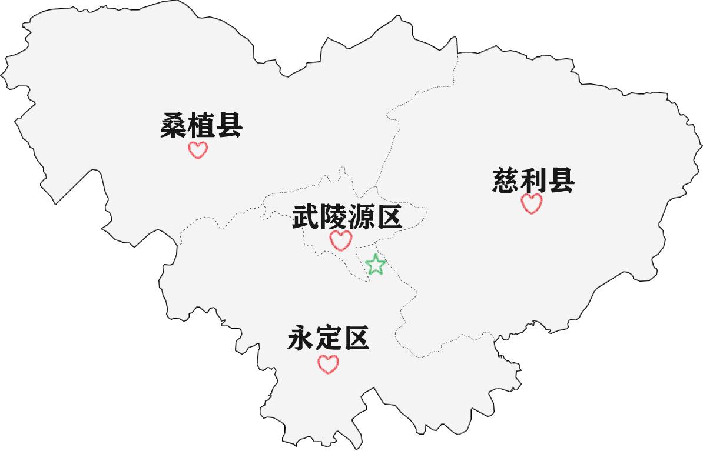

# 地理知识

**市中心or市区**位于永定区。从外地进入张家界市，不管是飞机、高铁、火车还是汽车，99%都是先到达永定区。

从上面的地图可以看出**武陵源区**比较特殊，被其他三个区县紧紧包围，这里是有历史渊源的。

# 武陵源的由来

起因源于**火烧止马塌**(也称做**火烧水绕四门**)，让大庸县撤县立市迫在眉睫。

张家界市成立前，为大庸县，基本可以等同于现在的永定区。
桑植县以前隶属于湘西的永顺县；
慈利县以前隶属于常德市；

随着张家界市的成立，大庸县、慈利县和桑植县将景区属地全部划出，成立**武陵源区**。

[火烧水绕四门：回忆催生张家界的最后一颗多米诺事件](https://mp.weixin.qq.com/s?__biz=MzA5NjI4MTYxMA==&mid=2650299998&idx=1&sn=28dbc65ae1dc2b62c7b53f26a2445a67&chksm=88be8b3bbfc9022dfdf72d88deadf2fe2bee0ef959c12c213d05d19bc04f1c198c9890e57e5a&scene=27)

博主老家在永定区、武陵源区和慈利县的交接之处，见图中绿色五角星位置，与宝峰湖只有一山之隔；差一点就被划到武陵源区。

[返回首页](/README)
