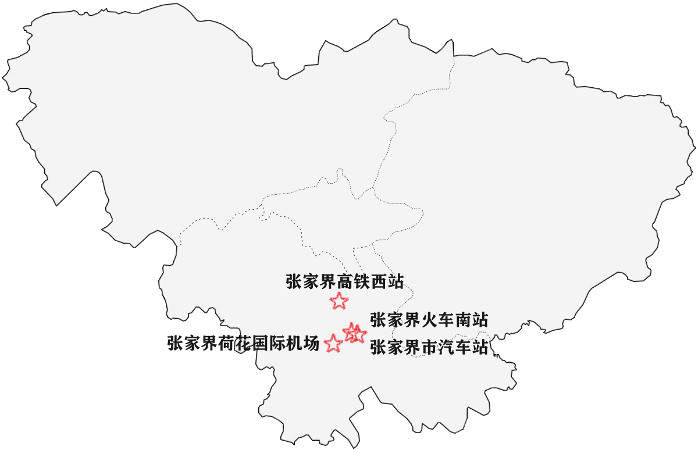
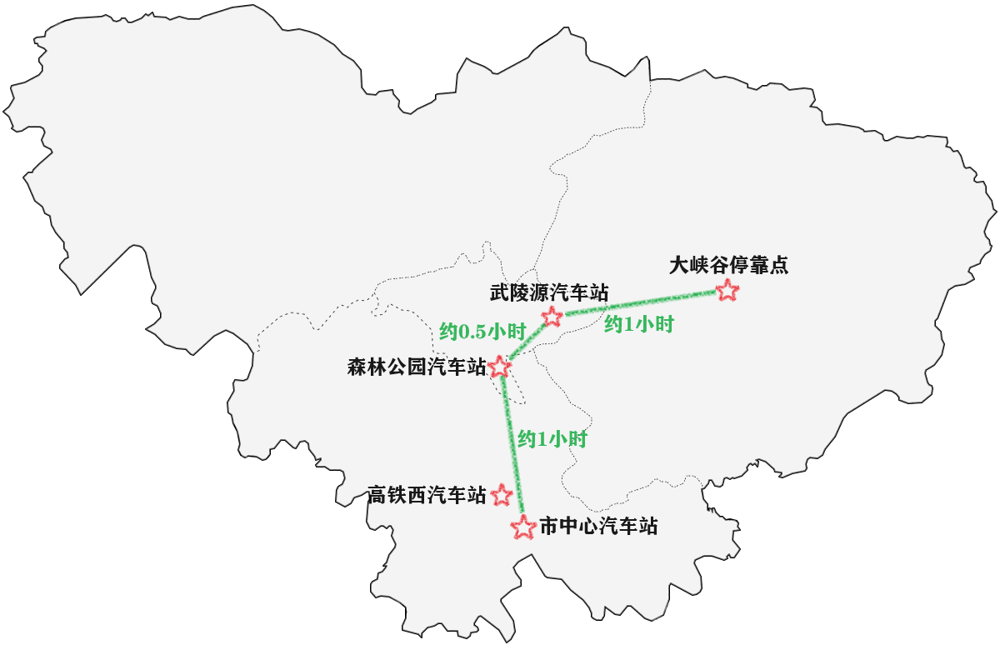

# 交通

## 如何前往&离开张家界

- **张家界荷花国际机场**: 该机场为国际机场，可直飞国外。

- **张家界高铁西站**: 高铁站，有高铁和动车。

- **张家界火车南站**: 普通火车。

- **张家界市汽车站**: 大巴车。

## 景区间交通

这里只介绍几个热门的车站。

> 记住: 所有景区之间都有班车。并且森林公园每个入口都有班车可达。市中心汽车站和武陵源汽车站能去往的目的地更多。

- **市中心汽车站**: 即张家界市汽车站；跟火车站南站在一起。且离天门山约10分钟步行路程。

- **高铁西汽车站**: 跟高铁西站在一起。

- **森林公园汽车站**: 在森林公园南门。

- **武陵源汽车站**: 在森林公园东门附近，约10~20分钟步行路程。

- **大峡谷停靠点**: 目前没有汽车站，但是有停靠点。

### 耗时

- 市中心
    - 森林公园南门: 约1小时
    - 森林公园东门: 约1.5小时
    - 大峡谷: 2+小时

- 森林公园南门
    - 森林公园东门: 约0.5小时

- 森林公园东门
    - 大峡谷: 约1小时

### 价格
10~20元/人不等。

[返回首页](/README)