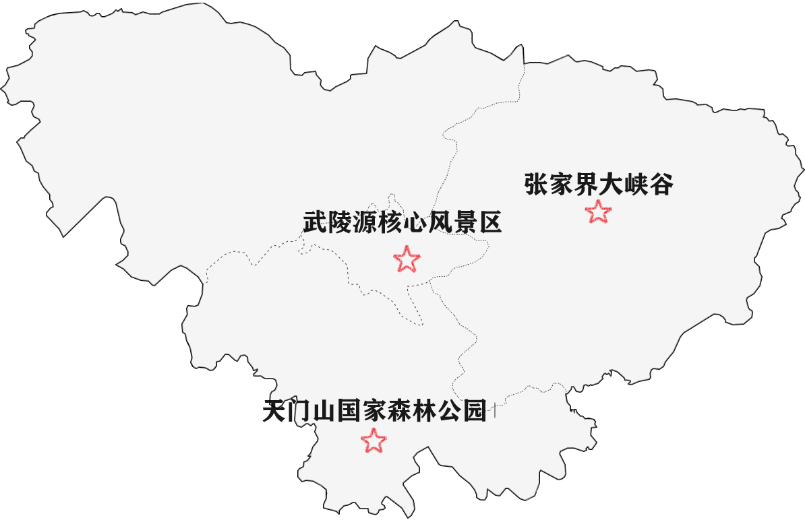
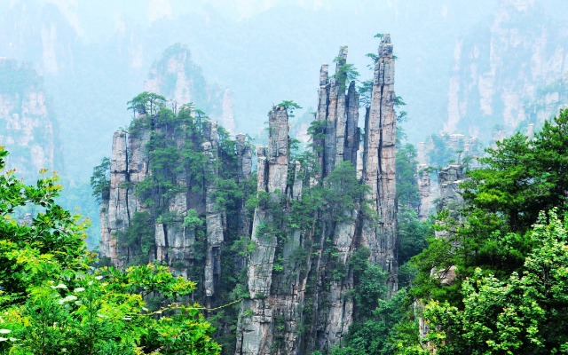
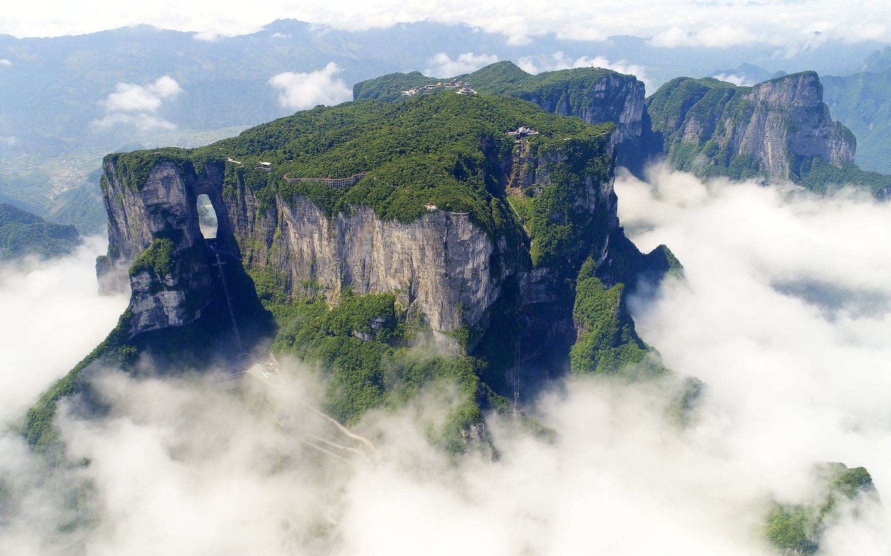
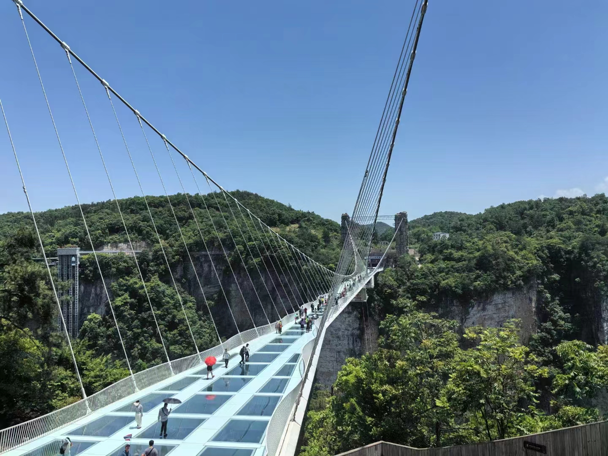
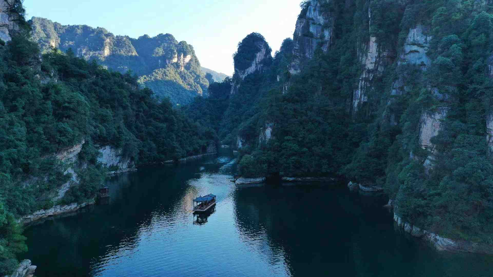
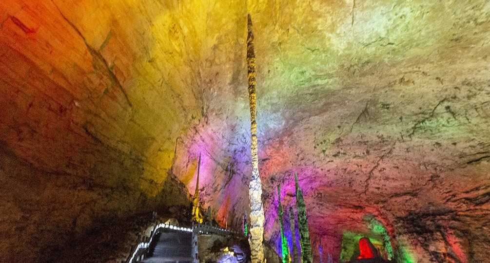
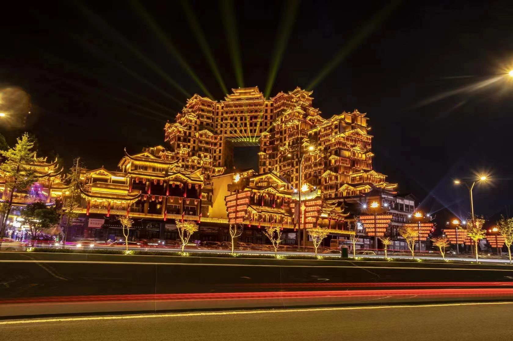

# 景区概览

# 武陵源核心风景区
即张家界国家森林公园，位于**武陵源区**。

1988年8月，张家界武陵源旅游区被列入国家重点风景名胜区；
1992年12月，因奇特的石英砂岩大峰林被联合国列入**《世界自然遗产名录》**，2004年2月被列入**世界地质公园**；
2007年被列入**中国首批国家5A级旅游景区**，公园总面积4810公顷。

# 天门山国家森林公园

**5A级旅游景区**，天门山索道，玻璃栈道。位于**永定区**。

# 张家界大峡谷

**4A级旅游景区**，玻璃桥。位于**慈利县**。

# 宝峰湖景区
位于**武陵源区**。

# 黄龙洞景区
位于**武陵源区**。

# 张家界七星山
位于**永定区**。

# 老道湾景区
位于**永定区**。

# 茅岩河景区
位于**永定区**。

# 五雷山景区
位于**慈利县**。

# 龙王洞景区
位于**慈利县**。

# 朝阳地缝景区
位于**慈利县**。

# 九天峰恋景区
位于**桑植县**，包含九天洞和峰恋溪。

# 72奇楼
位于**永定区**。

# 大庸古城
位于**永定区**。

# 溪布街
位于**武陵源区**。

[返回首页](/README)