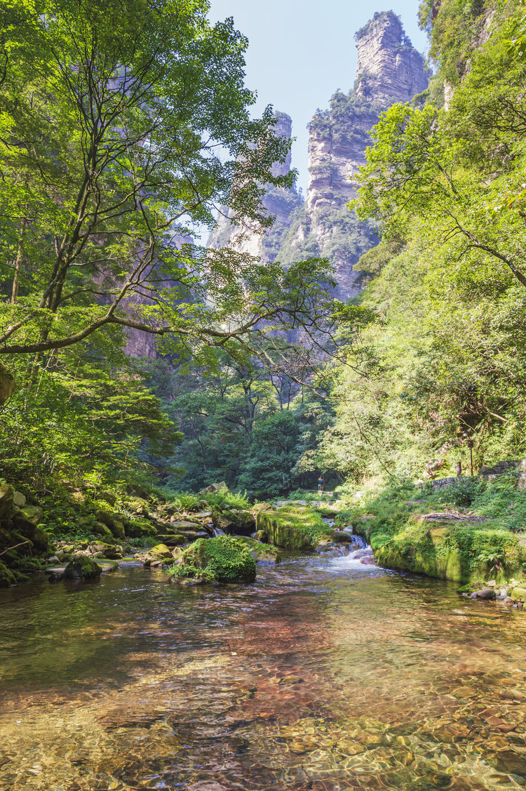

# 张家界国家森林公园

# 开放时间
**07:00 - 17:30**

# 推荐游玩时间
2-3天

# 入口

森林公园总共有5个入口，其中**南门**、**东门**为热门入口。

## 南门
森林公园门票站，邻近金鞭溪、黄石寨。

## 东门
标志门门票站，邻近天子山、袁家界、金鞭溪、十里画廊。

## 中门
梓木岗门票站，邻近袁家界、金鞭溪、十里画廊。

## 北门
天子山门票站，邻近天子山、袁家界。

## 西门
杨家界门票站，邻近天子山、袁家界、杨家界。

# 景区
## 天子山

## 袁家界

## 杨家界

## 黄石寨

## 金鞭溪

# 门票

**入园当天的17:00之前预定**

门票以[购票指南](/GouPiaoZhiNan/)为准。

## 票价

### 淡旺季划分
类别|月份
-|-
淡季|1月、2月、12月
旺季|3月-11月

### 景区门票

分类|普通票价|优惠票价
-|-|-
旺季(连续四天有效)|165|113
旺季游客网络提前10天以上购票实行优惠(连续四天有效)| |134
淡季(连续四天有效)|84|42
淡季游客网络提前10天以上购票实行优惠(连续四天有效)| | 67

### 交通工具

分类|普通票价|优惠票价
-|-|-
环保车|60|30
黄石寨索道(单程)|65|33
黄石寨索道(双程)|118|59
天子山索道(单程)|72|36
杨家界索道(单程)|76|38
十里画廊观光电车(单程)|38|19
百龙天梯(单程)|65|33
百龙天梯(单程)<试运行价>|25|13

### 年票
不区分淡旺季，均为**298**。

## 优惠政策

> 注意
所有优惠对象均须凭有效证件才能享受优惠政策，**须现场核验**。

### 免票对象
- 景区对14周岁(不含14周岁)以下的儿童
- 65周岁(含65周岁)以上老年人
- 残疾人
- 现役军人军队离退休干部
- 景区内宗教活动场所所属宗教教职人员及其工作人员，与景区内宗教活动场所所属的宗教是同一宗教的宗教教职人员

### 优惠对象(约半价)

- 对14周岁(含14周岁)~18周岁(不含18周岁)未成年人
- 全日制大学本科及以下学历在校学生
- 60周岁(含60周岁)至65周岁(不含65周岁)的老年人

## 门票注意事项

### 入园&出园
- 首次入园: 须按照选择的**时间段**和**入口**进入。
- 非首次入园: 入口不限制。
- 出园: 无限制。

> 关于首次入园的时间段问题，旺季高流量期间应该会严格执行；淡季的话不存在这个问题。
即使在旺季高峰期，正常沟通应该也能进，有网友进去过。

### 门票有效期
连续4天有效。

### 退票&改签
只要未超过票面当天闭园时间，**随时可退**，不收取违约金。

改签同退票。

### 未携带身份证
使用护照、回乡证、港澳通行证购买检票时出现证件验证不通过的，需要前往窗口补录人脸，然后通过人脸识别入园。

# 线路

## 一日游线路

### 线路1：天子山--->袁家界--->十里画廊一日游

特点
- 东门进东门出
- 大部分是乘坐交通工具，适合懒人

行程
- 上午
    - 入园：早上从东门入园
    - 前往天子山景区
        - 乘坐环保车到达天子山索道下站
        - 乘坐天子山索道到达天子山索道上站，即天子山景区

- 中午
    - 前往袁家界
        - 从天子山乘坐环保车到达袁家界
        - 午饭：建议自备食物和水
    
- 下午
    - 前往十里画廊
        - 乘坐百龙天梯下山
        - 乘坐环保车到达十里画廊
    - 出园
        - 乘坐环保车返回东门

### 线路2：天子山--->袁家界--->金鞭溪一日游

特点
- 东门进，南门出
- 费腿，需要全程走完金鞭溪，全长约7.5公里，2小时左右

行程
- 上午
    - 入园：早上从东门入园
    - 前往天子山景区
        - 乘坐环保车到达天子山索道下站
        - 乘坐天子山索道到达天子山索道上站，即天子山景区

- 中午
    - 前往袁家界
        - 从天子山乘坐环保车到达袁家界
        - 午饭：建议自备食物和水
    
- 下午
    - 前往金鞭溪
        - 乘坐百龙天梯下山
        - 步行走完金鞭溪
    - 出园
        - 从南门出园

### 线路3：黄石寨--->金鞭溪一日游

特点
- 南门进，东门出
- 费腿，需要全程走完金鞭溪，全长约7.5公里，2小时左右
- 超级费腿王者，步行上下黄石寨，然后再徒步走完金鞭溪

行程
- 上午
    - 前往黄石寨
        - 从南门进入步行到黄石寨索道下站
        - 乘坐索道前往黄石寨
- 下午
    - 前往金鞭溪
        - 在黄石寨索道上站乘坐索道下山
        - 午饭：建议自备食物和水
        - 沿金鞭溪步行到水绕西门
    - 出园
        - 从水绕四门乘坐环保车前往东门

## 两日游线路

[返回首页](/README)